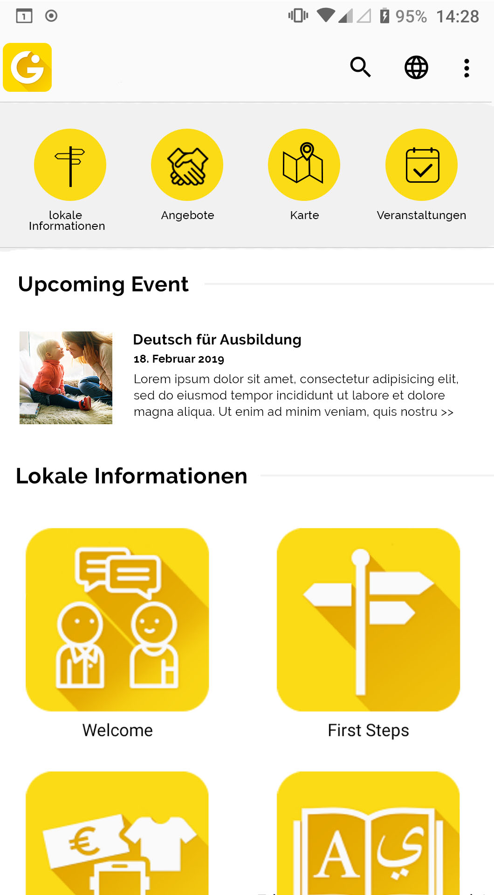
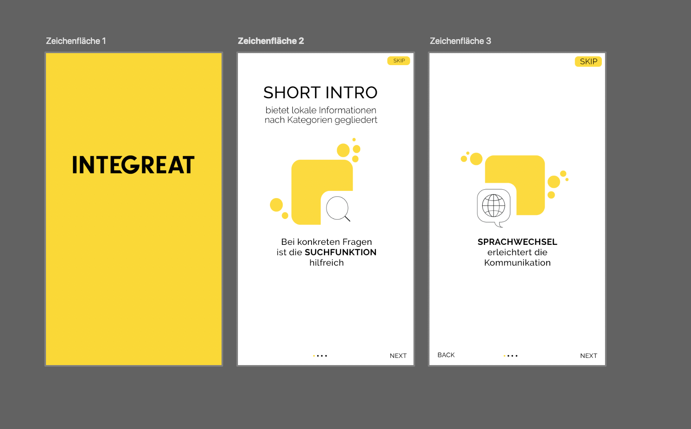

# Design Changes

###### WIP Change: Improve "Offers"
* Discussion on the next conference: Dissolve Extras category into Jobs, Apartment, Other (Other as category for extra wishes) → There is no icon and no wording that summarizes all extras, through the categorized presentation, the offers become more visible and more newcomers can benefit

###### Design Change: Release of the react-native app
The design of the react-native app will differ in a few points.
* "Extras" will be changed to "Angebote" (eng. "Offers")
* The tabs will get removed on Android and iOS
* A Dashboard is added:
 
 Note: The event preview is planned for a future design change.\
 Note: The header should contain the Integreat logo xor the back button on iOS and Android.
* If the user wants to change from a Page to an Event he has to navigate back to the Dashboard
* A new set of Icons will be defined and will replace all icons
* 'name_without_prefix' should be displayed in Header. The 'prefix' should be added in brackets. Like: Augsburg (Landkreis)
* There will be no language selection screen after selecting a city
* The new intro slides will be displayed after selecting a city

Nice to have:
* If possible try to add the name of the current city to multiple routes
